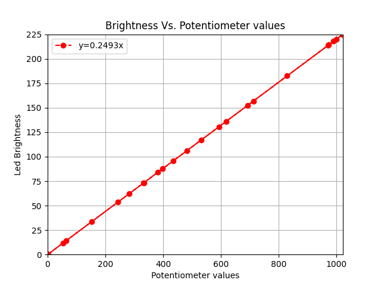
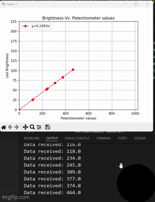

# Potentiometer Data Visualization System

This project demonstrates real-time data acquisition and visualization using an Arduino and Python.  
The Arduino reads values from a potentiometer and sends them over serial, while Python plots the incoming data live to show how the potentiometer controls LED brightness.

---

## 📌 Overview

This system consists of two parts:

### **1. Arduino (C++)**
- Reads analog input from a potentiometer (`A0`)
- Converts the reading to LED brightness using PWM (`D6`)
- Sends the raw potentiometer value through serial at 115200 baud

### **2. Python Visualization**
- Receives the serial data from the Arduino
- Computes LED brightness from the potentiometer value
- Plots both values in real time using Matplotlib + Drawnow

This setup provides a clear visual understanding of sensor behavior and system response.

---

## Project Structure

 📁 Led_control & pot_data_visualization/
 │
 ├── led_contol/
 │   └── led_contol.ino
 │
 ├── python/
 │   └── led_contol.py
 │
 ├── images/
 │   ├── graph_2.png
 │   ├── graph_3.png
 │   ├── graph.png
 │   ├── graphing_demo.mp4
 │   └── graphing_demo.gif
 │
 └── README.md

---
## Photos
### Brightness Vs. Potentiometer reading

### Real-time Plot

---

## 🔧 Hardware Requirements
- Arduino Uno or compatible board  
- Potentiometer  
- LED + resistor  
- Jumper wires  
- USB cable  

---

## 📈 Importance of Data Visualization

Data visualization transforms raw serial output into meaningful insight.
In this project, visualization helps you:

- See sensor values change instantly
- Verify hardware responsiveness
- Understand how analog input maps to PWM brightness
- Detect noise, irregular readings, or latency
- Communicate system behavior clearly for reports, demos, or documentation

Visualization is essential in embedded systems for testing, debugging, and understanding real-world performance

---

## 🚀 Applications

This workflow is widely used in:
- Sensor data monitoring
- Control system testing
- Real-time dashboards for IoT
- Robotics and automation systems
- Educational demonstrations
- Embedded systems diagnostics

---

## ▶️ How to Run
1. Upload the Arduino Code
 - Use the Arduino IDE to upload the C++ sketch to the board.
2. Install Python Dependencies
 - pip install pyserial numpy matplotlib drawnow
3. Run the Visualization Script
 - python visualize.py

## Result Video
<video src="https://github.com/kobbieessel/Potentiometer_Data_Visualization/blob/main/images/graphing_demo.mp4" width="500" controls></video>

